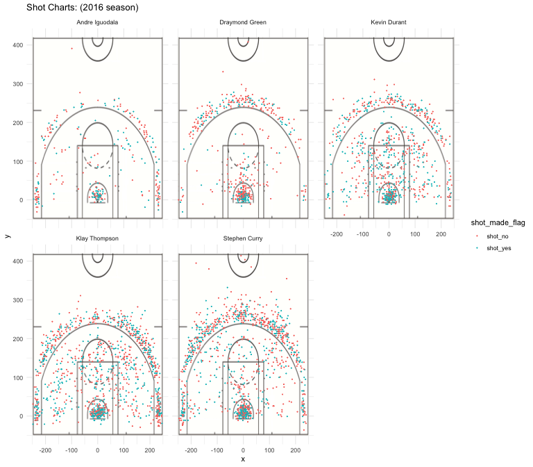

Workout 01
================
Gwyneth Jocelyn

Deep Dive into Golden State Warrior Stars' Shooting Statistics
--------------------------------------------------------------

It is widely accepted that Warriors has been a very strong team in the past few seasons and has won the last two NBA Championship. More specifically, Warriors' Iguodala, Green, Durant, Thompson and Curry lineup is very iconic and is known by different nicknames: **"Super Death" lineup** or **"Hamptons Five" lineup**, some even dub it the **"Light Years" lineup** for Warriors' ability to be light years ahead of its competitors. No matter what you call them, they are definitely a force to be reckoned with, successfully winning the Western conference during their year and bringing the team to the NBA Finals.

One of Warriors' main strength is its shooting efficiency. According to the NBA, The Warriors' has a field-goal efficiency of 58.5%, which is **the highest mark in NBA history**. However, looking into one of Warriors' finest starting five lineup, we can see that some players are better shooters than others. Here's the breakdown:

#### 1. Andre Iguodala

Andre Iguodala is a shooting guard / small forward who started his NBA career in Philadelphia 76ers in 2004. In 2012, he played for the Denver Nuggets for a year before joining the Golden State Warriors until now. Iguodala won an NBA championship with the Warriors in 2015 and was named the NBA Finals Most Valuable Player that year.

Among the five players, Iguodala made the least shooting attempts (371 attempts). Examining his performance in the 2016 NBA season, we found that Iguodala made 51.8% of his shots. Further examination also shows that Iguodala's 2-pointers shooting efficiency at a whooping 63.8%! is almost double that of his 3-pointers efficiency at 36.0%. This is consistent with his shot chart, which shows that he made most of the shots that he attempted closer to the ring.

<embed src="../images/andre-iguodala-shot-chart.pdf" width="80%" style="display: block; margin: auto;" type="application/pdf" />
#### 2. Draymond Green

Draymond Green is a 6'7 small forward and power forward from Saginaw, Michigan. He was recruited during his time in Michigan State University in 2012 by the Golden State Warriors and has been playing for them since. He played a key role on the Warriors' 2015, 2017 and 2018 championship teams. He is a part of the new generation of versatile frontcourt NBA players capable of playing and defending multiple positions.

During the 2016 NBA season, Green has an overall shooting efficiency of 42.4%, which is the lowest among the lineup. Looking closer into the numbers, we see that Green makes 49.4% of his 2-pointer shots and 31.9% of his 3 pointer shots. His shot chart also suggests that his shot attempts are concentrated near the ring, which may be attributed to his position as a power forward.

<embed src="../images/andre-iguodala-shot-chart.pdf" width="80%" style="display: block; margin: auto;" type="application/pdf" />
### 3. Kevin Durant

Kevin Durant was the 2nd overall pick in NBA's 2007 draft. From then on, he has had a very decorated NBA career: he has won two NBA championships, an NBA Most Valuable Player Award, two Finals MVP Awards, 2 NBA All-Star Game Most Value Player Awards, 4 NBA scoring titles, the NBA Rookie of the Year Award and 2 Olympic gold medals. Not only that, Durant has also played in eight All-NBA teams and ten NBA All-Star teams. As a result of this success, Durant is one of the higest-earning basketball players in the world.

NBA's 2016 season is Durant's first year in the Golden State Warriors. Prior to this, he has played for the Seattle SuperSonics and Oklahoma City Thunder. In his first season with the Warriors, Durant made 54.1% of the shots he attempted--the highest shooting efficiency among the five. Delving deeper into the statistics, we see that Durant has a shooting efficiency of 60.7% and 38.6% for his 2-pointers and 3 pointers shots, respectively. While he made a lot of shots near the ring, he has also had considerable success within the 3-point line.

<embed src="../images/kevin-durant-shot-chart.pdf" width="80%" style="display: block; margin: auto;" type="application/pdf" />
### 4. Klay Thompson

Klay Thompson is a Californian native who started his NBA career in 2011. He was picked during the draft by the Golden State Warriors and has been with the Warriors ever since. He is a five-time NBA All-Star, a three-time NBA champion and he helped lead the Warriors to their first NBA championship since 1975.

Klay Thompson as one of the greatest shooters in NBA history. He is one half of Warriors' Splash Brothers duo, known for their ability to "splash" the net with three-point shots. This is strongly backed by the numbers as well, since he has a 3-pointers shooting efficiency of 42.4%, the highest among the five players. In the 2016 NBA season, he has made 1220 shot attempts and scored with 47.1% of them. In the shot chart, we can see that he has made a significant number of shot attemps both within and outside of the three-point line.

<embed src="../images/klay-thompson-shot-chart.pdf" width="80%" style="display: block; margin: auto;" type="application/pdf" />
### 5. Stephen Curry

Steph Curry started his NBA career with the Golden State Warriors in 2009. Since then, he has played in six NBA All-Star, named the NBA Most Valuable Player twice and won three NBA championships with the Warriors. He is a point guard and is most well known for his three pointers. In fact, he haws been called the greater shooter in NBA history and is credited with revolutionizing the game of basketball by inspiring teams to regularly employ the three-point shot as part of their winning strategy.

Examining his performance in the 2016 season, we found that Curry made the most shots (584 shots) and the most three point shots (280 shots) among the five. With the higher point associated with the three point shot, he is undeniably the highest point contributor to the team. The shot chart shows that Steph Curry made a lot of shots both near the ring and outside of the three point line. The fact that he made a shot more than 300 feet away from the ring displays his ability as a shooter.

<embed src="../images/stephen-curry-shot-chart.pdf" width="80%" style="display: block; margin: auto;" type="application/pdf" />
A summary of the shot charts above can be seen below. 

As seen in Table 1, Steph Curry made both the most attempt and the most shots among the five. However, Durant dominated with the highest shooting efficiency with Iguodala coming in with a close second, while Green has the worst shooting efficiency. Overall, the lineup's efficiency hovers around the 50% mark.

| name           |  total|  made|  perc\_made|  desc(perc\_made)|
|:---------------|------:|-----:|-----------:|-----------------:|
| Andre Iguodala |    371|   192|    51.75202|         -51.75202|
| Draymond Green |    578|   245|    42.38754|         -42.38754|
| Kevin Durant   |    915|   495|    54.09836|         -54.09836|
| Klay Thompson  |   1220|   575|    47.13115|         -47.13115|
| Stephen Curry  |   1250|   584|    46.72000|         -46.72000|

Going deeper into the numbers, Table 2 shows that Iguodala and Durant once have the two highest shooting efficiency whie Green has the lowest for 2-point shots. Although Iguodala has a higher shooting efficiency, Durant made the most 2-point shots at 390 shots.

| name           |  total|  made|  perc\_made|  desc(perc\_made)|
|:---------------|------:|-----:|-----------:|-----------------:|
| Andre Iguodala |    210|   134|    63.80952|         -63.80952|
| Draymond Green |    346|   171|    49.42197|         -49.42197|
| Kevin Durant   |    643|   390|    60.65319|         -60.65319|
| Klay Thompson  |    640|   329|    51.40625|         -51.40625|
| Stephen Curry  |    563|   304|    53.99645|         -53.99645|

Lastly, we examine the shooting efficiency by player for 3-point shots. Table 3 further supports Thompson and Curry's position as the top 3-point shooter, with shooting efficiencies of 42.4% and 40.8% respectively, which earns them the nickname "Splash Brothers." Curry made the most 3-point shots at 280 points, followed closely by Thompson at 246 points. Green once again has the lowest shooting efficiency at 31.9%.

| name           |  total|  made|  perc\_made|  desc(perc\_made)|
|:---------------|------:|-----:|-----------:|-----------------:|
| Andre Iguodala |    161|    58|    36.02484|         -36.02484|
| Draymond Green |    232|    74|    31.89655|         -31.89655|
| Kevin Durant   |    272|   105|    38.60294|         -38.60294|
| Klay Thompson  |    580|   246|    42.41379|         -42.41379|
| Stephen Curry  |    687|   280|    40.75691|         -40.75691|

From this analysis, we can see that Warriors' reputation of having good shooters are not unfounded. Instead, the data does show that one of Warriors' most iconic lineup has a shooting efficiency that hovers around 40-50%. Among the five, they also specialize in terms of shots: Iguodala and Durant contributes has the best shooting efficiencies and are better with 2-pointers, Thompson and Curry earned their position as the best shooters in NBA history with their high shooting efficiency in 3-pointers, and Green serves as the defender within the group.
